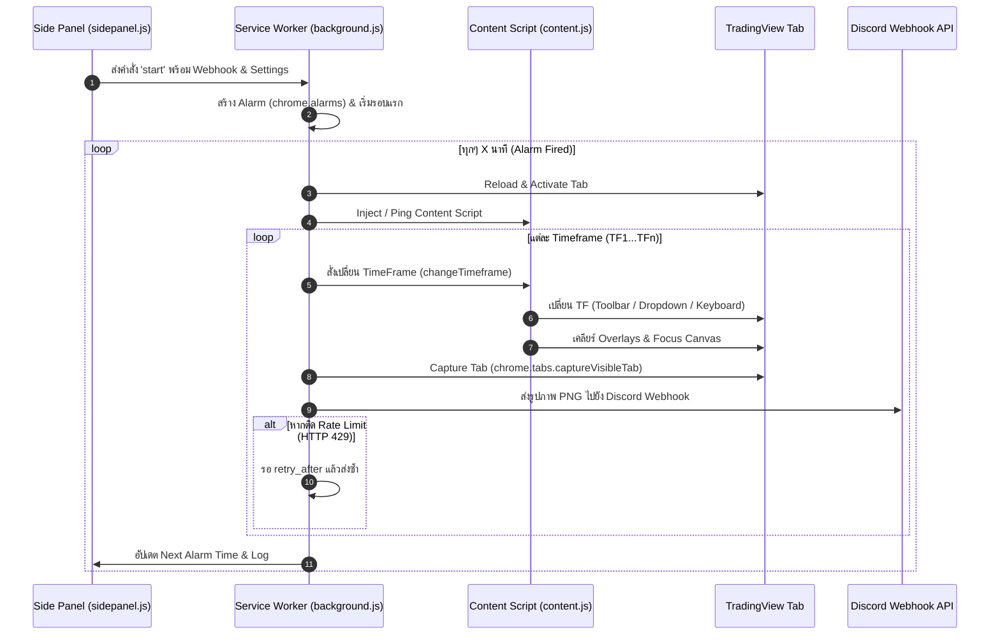

# tv2dis — TradingView to Discord Chrome Extension

**tv2dis** เป็น Chrome Extension (Manifest V3) สำหรับจับภาพหน้าจอ กราฟหุ้น/คริปโต จาก **TradingView** และส่งไปยัง **Discord Channel** อัตโนมัติผ่าน **Discord Webhook** ตามช่วงเวลาและ Timeframe ที่กำหนด

---

## 🌟 คุณสมบัติเด่น (Key Features)

- **Side Panel Interface**: สั่งการและตั้งค่าได้สะดวกผ่าน Side Panel ของ Google Chrome ในโทนสี Dark Mode ที่ทันสมัย
- **ส่งภาพอัตโนมัติเบื้องหลัง (Background Service Worker)**: ใช้ `chrome.alarms` ทำงานสม่ำเสมอแม้ปิด Side Panel
- **เลือกส่งหลาย Timeframe พร้อมกัน (Multi-Timeframe Capture)**: ตั้งค่าการส่งกราฟได้สูงสุดถึง **6 Timeframes** ต่อรอบการทำงาน (เช่น 15M, 1H, 4H, 1D)
- **ระบบจัดลำดับ Timeframe อัจฉริยะ (Strict Timeframe Validation)**: ป้องกันการตั้งค่า Timeframe ซ้ำซ้อน และบังคับเรียงลำดับเวลาจากน้อยไปมากโดยอัตโนมัติ
- **ระบบสลับ Timeframe 3 ระดับ (Triple-Strategy Timeframe Switcher)**:
  1. คลิกปุ่ม Direct Toolbar บน TradingView
  2. เลือกผ่าน Dropdown Menu Interval
  3. คีย์ลัดจำลองการพิมพ์บนคีย์บอร์ด (Keyboard Simulation Fallback)
- **ระบบทำความสะอาดหน้าจอกราฟ (Clean Screenshot Capture)**: ปิดป๊อปอัป (Overlays), ไฮไลท์ซ้อน หรือช่องค้นหาอัตโนมัติก่อนจับภาพ เพื่อให้ได้ภาพกราฟที่สะอาดที่สุด
- **จัดการ Discord Rate Limit อัตโนมัติ (HTTP 429 Retry)**: หากชนข้อจำกัดการส่งภาพของ Discord ระบบจะหน่วงเวลาแล้วลองส่งใหม่อัตโนมัติตามค่า `retry_after`
- **Real-time Countdown & Activity Log**: แสดงเวลาถอยหลังการส่งรอบถัดไป และบันทึก Log กิจกรรมพร้อมเวลาแบบเรียลไทม์

---

## 📁 โครงสร้างโปรเจกต์ (Project Structure)

```
tv2discord/
├── manifest.json       # ไฟล์กำหนดค่า Chrome Extension (Manifest V3)
├── background.js     # Background Service Worker (จัดการ Alarms, Screenshot & Webhook)
├── content.js        # Content Script สำหรับเปลี่ยน Timeframe และจัดการ DOM ใน TradingView
├── sidepanel.html    # หน้าต่างอินเทอร์เฟซ Side Panel
├── sidepanel.js      # ลอจิกการทำงานของ Side Panel UI และการจัดการ State
├── sidepanel.css     # สไตล์ UI โทน Dark Mode (Inter Font, Modern Aesthetics)
├── icon.png          # ไอคอนของส่วนขยาย

```

---

## 🛠️ วิธีการติดตั้ง (Installation)

1. **ดาวน์โหลด หรือ Clone โปรเจกต์**:
   ```bash
   git clone https://github.com/your-username/tv2discord.git
   ```
2. **เปิด Google Chrome** แล้วไปที่หน้าจัดการส่วนขยาย:
   ```text
   chrome://extensions/
   ```
3. **เปิดใช้งาน "โหมดนักพัฒนา" (Developer mode)** ที่มุมขวาบน
4. คลิกปุ่ม **"โหลดส่วนขยายที่ทำการแพ็กแล้ว" (Load unpacked)**
5. เลือกโฟลเดอร์โปรเจกต์ `tv2discord`
6. ส่วนขยาย **tv2dis** จะปรากฏขึ้นใน Chrome พร้อมใช้งาน!

---

## 🚀 คู่มือการใช้งาน (Usage Guide)

### 1. การตั้งค่า (Settings)
- **ส่งทุกๆ (Time Send)**: เลือกระยะห่างเวลาในการส่งกราฟ (5 นาที, 15 นาที, 30 นาที, 1 ชั่วโมง, 4 ชั่วโมง, 1 วัน)
- **จำนวน TimeFrame (Amount TF)**: เลือกจำนวน Timeframe ที่ต้องการจับภาพในแต่ละรอบ (1 ถึง 6 Timeframes)
- **ตัวเลือก TimeFrame (TF1 - TF6)**: กำหนดช่วงเวลาของกราฟ (1M, 5M, 15M, 30M, 1H, 4H, 1D)
- **Discord Webhook URL**: นำ Webhook URL จาก Discord Channel ที่ต้องการส่งภาพมาวางในช่องนี้
- คลิก **บันทึก (Save)** เพื่อจัดเก็บข้อมูลลงใน `chrome.storage.local`

### 2. ปุ่มควบคุม (Control Buttons)
- **🧪 Test (ทดสอบ)**: ส่งภาพกราฟตาม **TF1** ไปยัง Discord ทันที 1 ภาพ เพื่อทดสอบว่า Webhook และการจับภาพใช้งานได้ถูกต้อง
- **▶️ Play (เริ่มทำงาน)**: เริ่มต้นระบบการส่งภาพอัตโนมัติ โดยจะทำการส่งรอบแรกทันที และตั้งเวลาส่งในรอบถัดไปตามที่กำหนด
- **⏹️ Stop (หยุดทำงาน)**: ยกเลิกการตั้งเวลาและการทำงานทั้งหมดในเบื้องหลัง

---

## ⚙️ กลไกการทำงานทางเทคนิค (Technical Architecture)



### การทำงานหลักของไฟล์ต่าง ๆ:

1. **`background.js` (Service Worker)**:
   - เป็นหัวใจหลักในการรันกระบวนการทำงานเบื้องหลัง
   - ใช้ `chrome.alarms` ในการวนรอบทำงานสม่ำเสมอ
   - โฟกัสแท็บ TradingView, สั่งรีเฟรชหน้าก่อนจับภาพ, สั่งงาน `content.js`, จับภาพหน้าจอด้วย `captureVisibleTab` และส่ง HTTP POST (FormData) ไปยัง Discord Webhook

2. **`content.js` (Content Script)**:
   - ทำงานสอดแทรกบนหน้าเว็บ `https://*.tradingview.com/*`
   - ค้นหา Element ของ TradingView เพื่อสลับ Timeframe
   - ปิดป๊อปอัป / ช่องค้นหา (Symbol Search / Interval Dialog) และปลดล็อกโฟกัสช่องป้อนข้อมูลเพื่อไม่ให้บังภาพกราฟ

3. **`sidepanel.js` & `sidepanel.html`**:
   - ควบคุมการทำงานฝั่ง User Interface ใน Side Panel
   - มีระบบตรวจสอบความถูกต้องของ Timeframe (Validation Rules) ไม่ให้ตั้งค่าขัดแย้งกัน
   - ซิงค์ State และ countdown timer กับ `chrome.storage.local` แบบเรียลไทม์

---

## 💻 การรองรับ Windows 7 (Windows 7 Compatibility)

ส่วนขยาย **tv2dis** ได้รับการปรับแต่งให้รองรับการทำงานบน **Windows 7** อย่างสมบูรณ์ 100%:

1. **รองรับ Chrome 109 บน Windows 7**:
   - เนื่องจาก Google Chrome บน Windows 7 หยุดอัปเดตที่เวอร์ชัน 109 (ซึ่งยังไม่มี Side Panel API) ส่วนขยายจะเปลี่ยนมาใช้ **Action Popup** อัตโนมัติเมื่อกดไอคอนส่วนขยาย
2. **ปุ่มเปิดหน้าต่างแยก (Pop-out Window Mode)**:
   - ที่แถบด้านบน (Header) ของส่วนขยาย จะมีปุ่มไอคอน ↗️ **"เปิดหน้าต่างแยก"**
   - เมื่อกดปุ่มนี้ ส่วนขยายจะเปิดเป็นหน้าต่าง Standalone Window (ขนาด 400x680px) แยกออกมา
   - ช่วยให้ผู้ใช้ Windows 7 สามารถเปิดหน้าต่างตั้งค่าและดู Log ค้างไว้บนหน้าจอข้างๆ TradingView ได้ตลอดเวลาโดยไม่หุบหายเมื่อคลิกเปลี่ยนโฟกัส

---

## 💡 ข้อแนะนำเพิ่มเติม (Notes & Tips)

- **การเปิดแท็บ TradingView**: เพื่อให้โปรแกรมทำงานได้สมบูรณ์ ควรเปิดแท็บ TradingView ทิ้งไว้ในเบราว์เซอร์อย่างน้อย 1 แท็บ
- **การใช้ทรัพยากร**: โปรแกรมจะดึงแท็บ TradingView ขึ้นมาเป็นแท็บหลัก (Active Tab) ชั่วขณะขณะจับภาพ เพื่อให้มั่นใจว่าเบราว์เซอร์ Render ภาพกราฟได้อย่างถูกต้องเต็มประสิทธิภาพ

